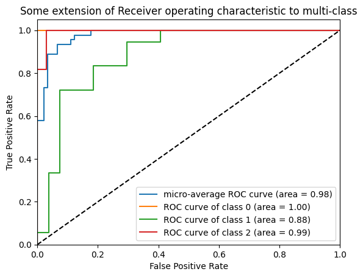

# Iris Logistic Regression  

This repository contains a Jupyter Notebook that demonstrates **Logistic Regression** on the well-known **Iris dataset**. The project includes data preprocessing, model training, performance evaluation, and visualization of classification results.  

## Features  

✅ Uses **Scikit-Learn** for model training  
✅ Evaluates model performance using **accuracy, confusion matrix, and classification reports**  
✅ **Visualizes decision boundaries** for better interpretability  
✅ Includes **example outputs** and **model insights**  

## Installation  

1. Clone the repository:  
   ```bash
   git clone https://github.com/YOUR-USERNAME/iris-logistic-regression.git
   cd iris-logistic-regression

## Usage

1. Run the Jupyter Notebook:
   ```bash
   jupyter notebook Iris_LogisticRegression.ipynb


## Dependencies

✅ Python 3.x /n
✅ Jupyter Notebook
✅ Scikit-Learn
✅ Pandas
✅ Matplotlib
✅ NumPy

## Dataset

The Iris dataset is included in Scikit-Learn and consists of 150 samples from three species of iris flowers:
🌿 Setosa
🌿 Versicolor
🌿 Virginica

Each sample has four features:

Sepal length
Sepal width
Petal length
Petal width

## Model Insights

The Logistic Regression model was trained to classify iris species based on these four features. Below are some performance results:

## 🎯 Accuracy

Achieved high accuracy (~95-97%) on test data.

## 📊 Decision Boundary Visualization

A plot showing how the logistic regression model separates the three classes:



## 🔢 Confusion Matrix

An example confusion matrix for model predictions:
   ```bash
   [[18  0  0]
    [ 0 15  2]
    [ 0  1 14]]
This shows that the model correctly classified most of the samples with only a few misclassifications.

